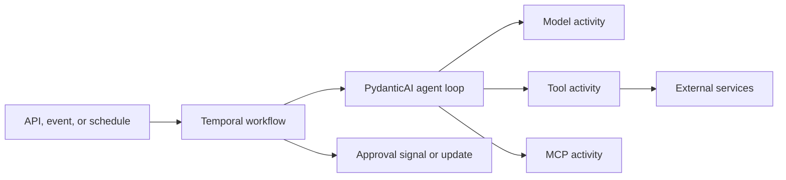

# 2. Reference architecture

## Repository structure

```text
project/
├── .agents/
│   └── skills/                       # Skills for coding/development agents
├── pyproject.toml
├── src/<package>/
│   ├── agents/
│   │   └── <agent_name>/
│   │       ├── agent.yaml
│   │       ├── factory.py
│   │       ├── dependencies.py
│   │       ├── models.py
│   │       ├── instructions/
│   │       ├── skills/               # Private runtime skills
│   │       └── tools/                # Private tools
│   ├── skills/                       # Shared runtime skills
│   ├── tools/                        # Shared executable capabilities
│   │   ├── common/
│   │   └── <domain>/
│   ├── workflows/
│   ├── activities/
│   ├── runtime/
│   ├── observability/
│   ├── policy/
│   └── settings.py
├── evals/
│   ├── datasets/
│   ├── evaluators/
│   ├── experiments/
│   ├── fixtures/
│   └── baselines/
├── tests/
│   ├── unit/
│   ├── integration/
│   ├── workflow/
│   ├── replay/
│   └── security/
├── docs/
│   ├── risk-assessments/
│   ├── threat-models/
│   └── runbooks/
└── deploy/
```

## Ownership rules

- Agent-private skills and tools remain colocated with their agent.
- A capability moves to the shared directory only when multiple agents use it or it represents a platform-wide concern.
- Shared directories MUST have explicit maintainers; they MUST NOT become unowned catalogs.
- Runtime Agent Skills belong under `src/<package>/skills/` or the agent package.
- `.agents/skills/` is reserved for development and coding-agent instructions.

## Runtime architecture



The workflow owns durable coordination. Activities own nondeterministic work and I/O. The agent factory assembles a validated configuration from approved models, skills, tools, policies, and runtime capabilities.

## Build and packaging

- Agent specifications, instruction files, and runtime `SKILL.md` files MUST be included as package data.
- Tests MUST load resources from the built wheel or equivalent deployment artifact.
- Runtime resource paths SHOULD be resolved with `importlib.resources`, not a process working-directory assumption.
- Production images SHOULD be immutable and run with a read-only application filesystem.

## Capability bill of materials

At startup, each agent produces a manifest containing:

```text
agent name and version
contract version
execution class, governance tier, and risk-assessment digest
resolved model and settings
instruction hashes
enabled skills, versions, and hashes
enabled toolsets and versions
output schema hash
budget policy
worker and build version
```

The manifest ID MUST appear in traces, audit records, and evaluation reports.
