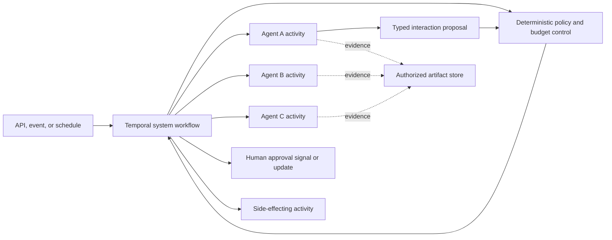

# 2. Reference architecture

## Repository structure

```text
project/
├── src/<package>/
│   ├── agents/                         # Agent Playbook packages
│   │   └── <agent_name>/
│   │       └── agent.yaml
│   ├── systems/
│   │   └── <system_name>/
│   │       ├── system.yaml
│   │       ├── factory.py
│   │       ├── models.py
│   │       ├── coordination.py
│   │       └── policies/
│   │           ├── delegation.yaml
│   │           ├── data-flow.yaml
│   │           └── termination.yaml
│   ├── workflows/
│   ├── activities/
│   ├── runtime/
│   ├── observability/
│   └── policy/
├── evals/
│   └── systems/<system_name>/
│       ├── datasets/
│       ├── evaluators/
│       ├── experiments/
│       ├── fixtures/
│       └── baselines/
├── tests/
│   ├── system/
│   ├── workflow/
│   ├── replay/
│   └── security/
├── docs/
│   ├── architecture-decisions/
│   ├── risk-assessments/
│   ├── threat-models/
│   └── runbooks/
└── deploy/
```

Member agent packages retain the structure required by the Agent Playbook. A
system package references them; it MUST NOT fork their prompts, tools, or specs
into composition-local copies.

## Runtime architecture



The workflow owns durable state and coordination. Deterministic policy validates
membership, edges, schemas, authority, data flow, budgets, approval, and
termination. Agent activities interpret, plan, investigate, review, and
synthesize within those boundaries. Large artifacts remain outside workflow
history and are passed by authorized reference.

## Topology profiles

### Programmatic pipeline

Deterministic code invokes members in a fixed order and maps typed outputs to
typed inputs.

Use it as the default when the stages and transitions are known. It has the
smallest routing surface and is easiest to replay, test, and explain.

### Supervisor and worker

A coordinator proposes which allowlisted specialist should handle a bounded
task. Deterministic policy validates the proposal before dispatch.

Use it when the appropriate specialist depends on interpreted request content.
The coordinator MUST have finite choices, depth, fan-out, rounds, and budget.

### Bounded fan-out and gather

Several members work independently before deterministic aggregation or a
separate synthesis step.

Use it when parallelism or independent evidence materially improves latency,
coverage, or confidence. The system MUST define maximum concurrency, stable
branch identities, merge ordering, duplicate handling, and partial-failure
behavior.

### Producer and reviewer

One member produces a result and another evaluates it against a typed rubric.
Deterministic policy accepts, rejects, retries, or escalates the result.

Agent review is behavioral evidence. It MUST NOT grant authorization, approve a
consequential action, accept residual risk, or replace required human review.

### Handoff

Control transfers from one member to another and does not automatically return.

Use it when responsibility genuinely changes. The handoff MUST transfer a typed
state summary, evidence references, remaining budget, deadline, authorization
context, and explicit ownership of the next outcome.

### Quorum or voting

Multiple members produce judgments combined by a documented aggregation rule.

Use it only when evaluation shows that the selected independence and aggregation
method improve the target outcome. Agreement is not evidence of truth, and
correlated models or prompts MUST NOT be represented as independent votes.

### Hierarchical teams

A root coordinator delegates to domain coordinators, which manage bounded
specialist groups.

Use it for large tasks with stable domain boundaries, separate owners, or
different security and operational zones. Hierarchy reduces the root
coordinator's context and routing surface, but adds handoff loss, compounded
latency, nested budgets, and the risk that summaries hide important evidence or
dissent.

### Shared blackboard

Members coordinate through a governed shared state containing tasks, claims,
evidence, and status rather than communicating only through direct calls.

Use it for iterative investigation, planning, scientific or engineering work,
and other tasks where contributors must build on partially completed work. It
supports asynchronous collaboration and flexible ordering, but introduces
contention, stale state, poisoning, provenance, consistency, retention, and
termination challenges. The blackboard MUST have typed records, controlled
writers, provenance, conflict rules, and a deterministic state owner.

### Peer-to-peer mesh

Members communicate directly across several allowed edges without one
model-driven coordinator selecting every interaction.

Use it when responsibilities are genuinely distributed, local decisions are
valuable, or the system must continue when one coordinator is unavailable. A
mesh can reduce bottlenecks and improve local autonomy, but makes global state,
authorization, observability, convergence, and incident containment materially
harder. Production meshes SHOULD retain a deterministic control plane even when
their work plane is decentralized.

### Recursive task tree

A member may decompose work and delegate bounded subtasks, whose members may do
the same until a terminal condition is reached.

Use it when the task structure is not known in advance and decomposition quality
is part of the desired capability, such as broad research, migration analysis,
or large repository work. Recursive trees adapt well to irregular problems and
parallelism, but can multiply cost, latency, duplicated work, inconsistent
assumptions, and cancellation complexity. They require strict depth, fan-out,
node, time, token, and spend limits plus no-progress detection.

### Dynamic membership

The system selects or admits members during a run from a governed registry.
Selection may consider required capability, jurisdiction, data residency,
availability, price, latency, model diversity, or current system state.

Use it when the required expertise or capacity cannot be fully predicted, when
capabilities are supplied by independently deployed teams, or when graceful
substitution is a product requirement. Dynamic membership improves adaptability
and extensibility, but expands the authorization, compatibility, supply-chain,
reproducibility, and evaluation surface. Discovery alone is never admission.

### Market or contract-net allocation

Candidate members publish typed offers or bids for bounded tasks, and
deterministic policy selects an offer using declared criteria.

Use it when agents differ materially in capability, price, latency, locality, or
availability and centralized static routing would be inefficient. It can improve
resource allocation and resilience, but bidding adds overhead, strategic or
misleading claims, nondeterminism, and fairness concerns. Bid claims MUST be
validated against registry metadata and measured performance; agents cannot bid
for authority outside their admitted ceiling.

### Event-driven collective

Members react to typed events or state transitions and may emit further events
within an allowlisted protocol.

Use it for monitoring, operations, and long-running systems whose work arrives
asynchronously. Event-driven systems decouple producers and consumers and scale
well, but must handle duplicate, delayed, missing, and reordered messages,
eventual consistency, feedback loops, and difficult causal reconstruction.

## Architecture selection matrix

| Architecture | Best fit | Principal benefit | Principal cost or trade-off |
| --- | --- | --- | --- |
| Programmatic pipeline | Known stages and regulated processes | Predictable, testable control flow | Limited adaptation to unexpected work |
| Supervisor and worker | Ambiguous requests with stable specialists | Flexible routing with a small graph | Coordinator bottleneck and routing error |
| Fan-out and gather | Decomposable research or independent checks | Parallelism, coverage, and redundancy | Cost multiplication and result reconciliation |
| Producer and reviewer | Outputs with a useful review rubric | Separates generation from critique | Added latency and correlated reviewer failure |
| Handoff | Genuine transfer of responsibility | Clear specialization and lifecycle ownership | Context loss and ambiguous ownership at transfer |
| Quorum or voting | Independent judgments under uncertainty | Robustness when errors are genuinely diverse | Expensive; consensus can still be wrong |
| Hierarchical teams | Large systems with stable domains | Scales specialization and ownership | Compounded summaries, latency, and budgets |
| Shared blackboard | Iterative collaborative investigation | Flexible asynchronous contribution | State poisoning, contention, and convergence |
| Peer-to-peer mesh | Distributed local decisions | Avoids one work-plane bottleneck | Hard global governance and observability |
| Recursive task tree | Unknown decomposition and irregular tasks | Adaptive depth and parallel task discovery | Potentially exponential resource use |
| Dynamic membership | Variable expertise, locality, or capacity | Adaptability and extensibility | Supply-chain, compatibility, and reproducibility risk |
| Market or contract-net | Heterogeneous cost and capability | Adaptive resource allocation | Bid overhead, gaming, and selection complexity |
| Event-driven collective | Continuous asynchronous operations | Loose coupling and scalability | Delivery semantics and feedback-loop risk |

These profiles can be combined. For example, a deterministic workflow may
start a bounded fan-out whose branches use producer/reviewer pairs, or a
hierarchical system may dynamically select one specialist within each governed
domain. The System Spec MUST describe the combined topology and calculate limits
across the whole composition rather than treating each profile in isolation.

## Static and dynamic systems

Static and dynamic are a spectrum rather than a binary classification:

| Dimension | More static | More dynamic |
| --- | --- | --- |
| Membership | Pinned before deployment | Selected or admitted during a run |
| Routing | Deterministic transitions | Model-, policy-, or market-selected edges |
| Topology | Fixed directed graph | Run-specific graph assembled from allowed rules |
| Decomposition | Predefined stages | Recursive task discovery |
| State | Workflow-local typed state | Shared or event-driven collaborative state |
| Lifetime | Bounded request or workflow | Persistent collective with changing participants |

Dynamic behavior is appropriate when its adaptability, resilience, parallelism,
or capability reach produces a measured benefit that exceeds its additional
quality, security, operational, latency, and cost burden. It is inappropriate
when the same result can be achieved through a simpler topology without losing
a material product or control objective.

A dynamic system MUST still have a static control envelope: trusted registries,
admission rules, maximum authority, permitted protocols, data boundaries,
resource ceilings, terminal conditions, audit requirements, and kill switches
are established before the run.

## Selection rule

Choose the least dynamic topology that satisfies the documented need:

```text
deterministic code
    before programmatic pipeline
        before model-selected supervisor/worker
            before dynamic membership or recursive topology
```

This ordering is a burden-of-proof rule, not a maturity ranking. A dynamic
architecture is not inherently better or worse; it is justified when the
system's evidence shows that adaptability is necessary and its added failure
modes are acceptably controlled.

Topology is part of system behavior. Changing topology, routing authority,
aggregation, concurrency, or membership requires a system version change and
relevant evaluation and risk review.

## State ownership

The System Spec identifies one authority for each state category:

| State | Required owner |
| --- | --- |
| Workflow status, branch status, and termination | Temporal workflow |
| Authorization and approval | Deterministic policy and authenticated identity |
| Budget reservations and consumption | Shared budget service or workflow-backed ledger |
| Large evidence and artifacts | Authorized external store |
| Agent-local message history | That agent run only |
| Accepted facts and final decision | Declared deterministic system component |

Shared mutable transcripts SHOULD NOT be the canonical system state. If shared
memory is used, its writer policy, reader policy, schema, provenance, conflict
model, retention, deletion, and poisoning controls MUST be explicit.

## Workflow decomposition

Start with one top-level workflow when the coordination history is bounded. Use
child workflows only when a branch needs an independent durable lifecycle,
separate worker ownership, independent cancellation policy, or history scaling.
Code organization alone is not sufficient justification.

Every branch and interaction has a stable ID. Concurrent results are reconciled
using deterministic ordering and conflict policy. Cancellation, compensation,
and final outcome semantics cover the entire delegation tree.

## Composition manifest

At startup or build time, resolve the System Spec into an immutable composition
manifest containing:

```text
system name, version, contract version, and spec digest
owner, execution class, governance tier, and risk-assessment digest
topology and policy versions
member roles, Agent Spec versions, and agent manifest IDs
allowed interaction edges and input/output schema hashes
resolved system, member, and interaction budgets
workflow, worker, and build versions
evaluation policy and approved baseline
```

The manifest ID MUST appear in traces, audit records, evaluation reports,
approval records, deployment records, and incident references.

## Ownership rules

- The system has one accountable product owner and one operational owner.
- Every role and interaction edge has an owning team.
- Member owners remain accountable for their agent contracts.
- System owners are accountable for integration behavior and composition risk.
- Shared policies and registries have explicit maintainers.
- No member, edge, policy, or shared state store is admitted without an owner.
